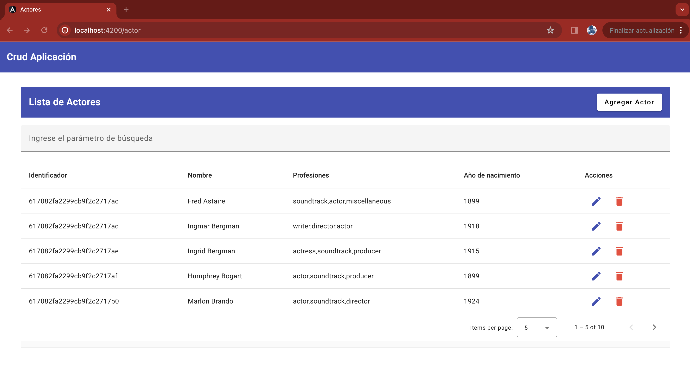

# NisumCrud

**Bienvenidos to my GitHub I'm Edison**

Este proyecto esta generado con la version de angular [Angular CLI](https://github.com/angular/angular-cli) version 15.2.10.

## Detalles superficiales del trabajo realizado

  
   
  <em>Aplicación mediante la cual el usuario puede realizar la creación y visyalización Actores.</em>
   

- Elige alguna API free de este sitio si ninguna te convence.
- Construye una App en Angular 5+ (De preferencia la que mejor conozcas) usando como UI Angular Material (si usas uno distinto,
  nos cuentas el porque decidiste por otra UI).
- Necesitamos que tu App sea responsive.
- Necesitamos que tu App tenga la capacidad de ser un CRUD que trabaje de forma temporal con la DATA de la API, es decir,
  debemos poder eliminar, editar y crear data temporalmente, si actualizamos la data debe volver a su estado inicial.
- Procura mantener la data en memoria (localStorage).
  . Validación de inputs respecto a los datos que se requieran ingresar.
  . Evaluaremos tu código y te contactaremos.

## Development server

Ejecute `ng serve` para levantar el servidor web. Acceda a la url `http://localhost:4200/`.

## Running unit tests

Para la ejecución de los test unitarios por favor ejecute el siguiente comando.
Run `npm run test` to execute the unit tests via jest.
